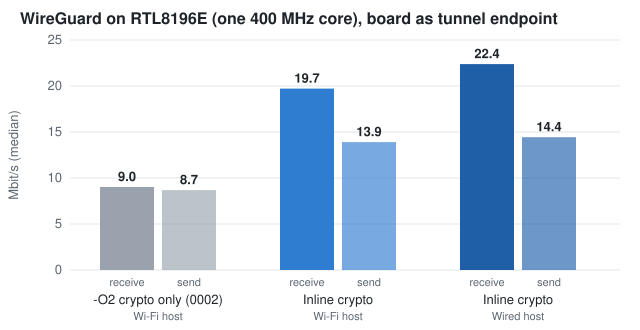

# Fast kernel WireGuard on a single-core RTL8196E

Kernel patches and measurements for in-kernel WireGuard on the Realtek RTL8196E
(Lexra RLX4181, ~400 MHz, one core, 32 MiB RAM), as found in the SilverCrest
SGWZ 1 A1 Zigbee gateway. The kernel is Linux 6.18.54 with the
[jnilo1/rtl8196e-gateway](https://github.com/jnilo1/rtl8196e-gateway) port.



| Board as WireGuard endpoint (iperf3, median of five) | Receive | Send |
| --- | --- | --- |
| `-O2` crypto only, Wi-Fi test host (one run) | 9.0 Mbit/s | 8.7 Mbit/s |
| Inline crypto (recommended set), Wi-Fi test host | **19.7 Mbit/s** | **13.9 Mbit/s** |
| Inline crypto (recommended set), wired test host | **22.4 Mbit/s** | **14.4 Mbit/s** |

Traffic routed through the board into a WireGuard tunnel runs at 8.6–9.4
Mbit/s in either direction with the CPU at 96–98%. Plain TCP to the board,
without WireGuard, runs at 73–88 Mbit/s. All figures are in
[results/measurements.csv](results/measurements.csv).

## What made the difference

WireGuard is not limited by the cipher on this CPU. It is limited by the
**cost of each packet**. Sending UDP through the tunnel, the board managed
917, 904, 888 and 856 packets/s for 64, 256, 700 and 1380-byte payloads
([per-packet.csv](results/per-packet.csv)): 21 times more data, 7% fewer
packets. That is ~440,000 cycles per packet.

The kernel's PC sampler (`profile=4`) showed where they went. During a
WireGuard transfer about 22% of all samples sat on the IRQ re-enable after
`__schedule()` and `finish_task_switch()`, i.e. on context switches, and
`/proc/stat` counted ~0.85 context switches per tunnelled packet. WireGuard
hands every packet to its crypt workqueue so that encryption can run on
several CPUs, then to a per-peer worker to restore order. On one CPU that
buys nothing and costs a context switch per hop.

[`0005`](patches/0005-wireguard-inline-crypto-up.patch) removes those hops
when `CONFIG_SMP` is off:

- **Send:** the packet still goes on the peer's queue (it keeps the order and
  the references), then it is encrypted in place and sent at once.
- **Receive:** the packet is queued as undecrypted and the peer's NAPI poll
  decrypts it within its own budget. A first version decrypted in the UDP
  receive path, inside the Ethernet driver's NAPI poll; that raised
  `time_squeeze` 14-fold and made TCP collapse with retransmits.

Context switches fell to 0.03–0.09 per packet and the scheduler's share of
the profile from ~22% to ~4%. A cleaned-up version of this change is in
[upstream/](upstream/), prepared for the WireGuard and netdev lists.

## Patches

Apply on top of the port at revision `30eb5e5`. Each one after `0001` is an
opt-in switch of [build-wireguard-kernel.sh](build-wireguard-kernel.sh).

| Patch | Switch | Effect |
| --- | --- | --- |
| [0001](patches/0001-preserve-stock-flash-layout.patch) preserve stock flash layout | always | Keeps the five stock MTD partitions so only the kernel partition changes (board specific) |
| [0002](patches/0002-lib-crypto-O2.patch) `-O2` for the generic ChaCha path | `LABGW_CRYPTO_O2=1` | Receive +10% (the kernel is otherwise `-Os`) |
| [0003](patches/0003-lib-crypto-mtune-r3000.patch) `-mtune=r3000` for those files | `LABGW_CRYPTO_TUNE=1` | The Lexra gcc patch defines `PROCESSOR_LX4380` without an rtx cost table; tuning for R3000 shrinks `chacha20poly1305.o` from 5842 to 4762 bytes |
| [0004](patches/0004-wireguard-crypt-wq-single-worker.patch) drop `WQ_CPU_INTENSIVE` | `LABGW_WG_ONE_WORKER=1` | **Negative**: 20–24% slower; the pipeline serialised and the CPU idled |
| [0005](patches/0005-wireguard-inline-crypto-up.patch) inline WireGuard crypto on UP | `LABGW_WG_INLINE=1` | With 0002 and 0003: receive ×2.2, send ×1.6 (same Wi-Fi host) |
| [0006](patches/0006-lexra-bswap-and-fused-chacha.patch) inline byte swaps + one-pass ChaCha XOR | `LABGW_LEXRA_FAST=1` | **Negative**: ~6.5% slower in a wired A/B, despite removing 144 libgcc `__bswapsi2` calls |

The recommended set is `0001 0002 0003 0005`.

The ChaCha change in `0006` was checked against the original code on the
board before it was measured: [tools/chacha_xor_diff.c](tools/chacha_xor_diff.c),
5000 random lengths and alignments, 0 differences.

## Build

On Linux, with the port's Lexra toolchain (`mips-lexra-linux-musl-*`) on `PATH`:

```sh
git clone https://github.com/jnilo1/rtl8196e-gateway.git port
git -C port checkout --detach 30eb5e5b9ee334d2c6d76812acd4a6cdf2923423
LABGW_CRYPTO_O2=1 LABGW_CRYPTO_TUNE=1 LABGW_WG_INLINE=1 \
  ./build-wireguard-kernel.sh "$PWD/port" clean
```

The image is written to
`port/3-Main-SoC-Realtek-RTL8196E/32-Kernel/kernel-img/lidl/kernel-6.18.img`.
The script checks the port revision, that WireGuard, TUN, policy routing,
legacy iptables and NAT survived Kconfig, the partition size and the Realtek
image header. It never writes to a device.

Installing a kernel is device specific and can leave a board that only
boots with UART access; follow the port's documentation. The busybox `ip`
on the stock root filesystem has no `rule` or table support, so policy
routing needs a full iproute2 `ip` in userspace.

## Measurement method

- iperf3 on the board (the port's static build) and on a Linux host; the
  host reached the board over Wi-Fi until it was moved to a wired port. Wired
  runs vary by ~0.1 Mbit/s, Wi-Fi runs by several Mbit/s, so only figures
  from the same host link are compared.
- WireGuard peers on the host ran in Docker containers with the standard
  kernel implementation, so every run is also an interoperability check.
- Profiles came from builds with an empty I-MEM window and `profile=4`; the
  decoder is [tools/profile_decode.py](tools/profile_decode.py).
- Routed figures come from a policy-routing gateway daemon forwarding a LAN
  client into an outbound tunnel, and an inbound peer reaching the LAN
  through a fixed-tuple UDP relay. They are single runs.

## Limits

- One board, one kernel version. Other single-core devices have not been tried.
- IPv6 and long-running stability were not measured.
- `0005` disables bottom halves while it encrypts a GSO batch; on a 64 KB
  batch that is tens of milliseconds on this CPU. No losses were seen, but
  latency-sensitive setups may want a smaller `gso_max_size` on the tunnel.

## License

GPL-2.0, like the Linux kernel these patches modify. See [LICENSE](LICENSE).
The port is by jnilo1; WireGuard is by Jason A. Donenfeld.
